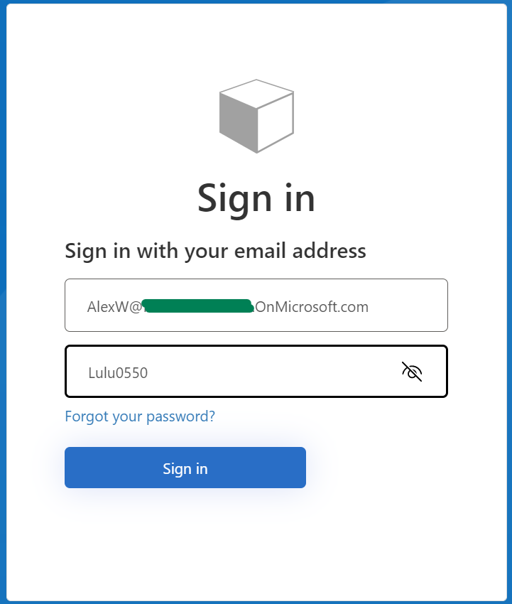
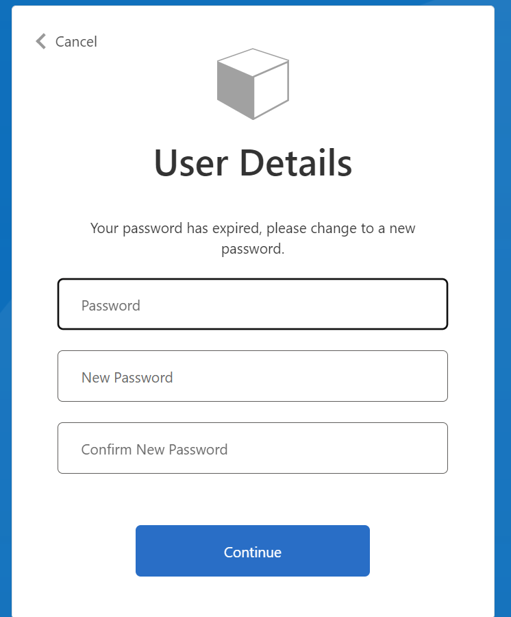

# Add external user authentication to your web application with the reset password flow
This tutorial shows you how authenticate selected external users with your web application and with optional password reset feature

## Scenario overview. Contoso Books

Contoso Books, Ltd. is a small but growing company that offers digital purchases of books. They were very succesfull by providing an inventory that is comparable to what the larger online book stores offer. Now they would like to provide analytics services to the book publishers interested in the readers reviews for selected books. Publishers interested in the review analytics will submit a list of books they are intersted in through the Contoso publishers Analytics Portal.

Contoso Books wants to manage publisher accounts accessing the Analytics Portal. Publishers should be able to reset their passwords. Contoso Books decided to use [Azure AD B2C](https://docs.microsoft.com/en-us/azure/active-directory-b2c/overview) as the Identity Provider service.

## Setup Azure AD B2C
Login into Azure Portal and create a new Azure AD B2C tenant:

It will take a few minutes to create a new tenant

Navigate to your new tenant:

Create an App Registration for your web application. For the test purposes use https://jwt.ms as the redirect URL

Switch back to the AAD B2C blade:

Switch to Users to add a new publisher user since we are not providing a public sign-up to our portal:

Fill in your publisher user data:

You will see a new user created:

You can reset user password and share it with your publisher

Create a new authentication flow for your user from the AAD B2C blade and select User flows:

Select Sign-in:

and "Recommended"

Fill in the Flow data:

Now you can test your flow:

But before that you need to finish the flow configuration:

Save and test it (Run user flow):

The browser will display the authentication challenge:

The user will be requested to change the password:

The password will be changed:

and our test reditect URL (jwt.ms) will return an empty result:

Now let's test self-service password reset:

Run the workflow again:

The verification code was sent to your publisher user.

The publisher will open the email:

and use the verification code:

and continue:

new password will be entered:

and again empty test jwt.ms content will be displayed.

The user has the right password now and wants finally to authenticate with the application:

Run the user flow again:

The token is and was empty because we do not set the token usage in the application registration (TODO - need to have it right at the beginning)):

Go the the App Registration/Authentication and change it:

and run the flow again

We are still missing Country or Region in the claims. Let's configure it:

and run the flow again:

let's also add the user email address to the claims:

and run the flow again:

our next step will be to configure our Analytics Portal instead of jwt.ms so that the claims will be used by the application after the authentication.

